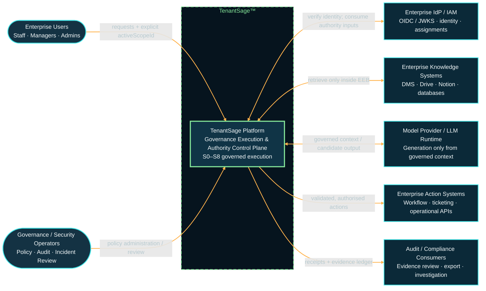

# tenantsage-artifact

## System Architecture

### Key Components

- **TenantSage Platform**: Central governance execution and authority control plane supporting S0–S8 security levels
- **Enterprise Users**: Staff, managers, and admins making requests with explicit scope identifiers
- **Governance/Security Operators**: Policy administrators and audit reviewers
- **Enterprise IdP/IAM**: Identity verification and authority assignments via OIDC/JWKS
- **Knowledge Systems**: Document management, Drive, Notion, and databases (access controlled by Enterprise Execution Boundary)
- **LLM Runtime**: Generates output only from governed context
- **Action Systems**: Executes validated and authorized workflows, ticketing, and operational APIs
- **Audit/Compliance**: Maintains receipts and evidence ledger for investigation and export
